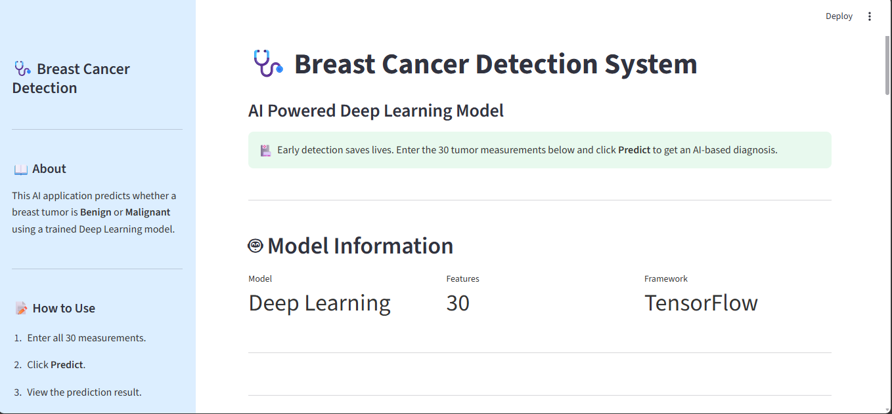
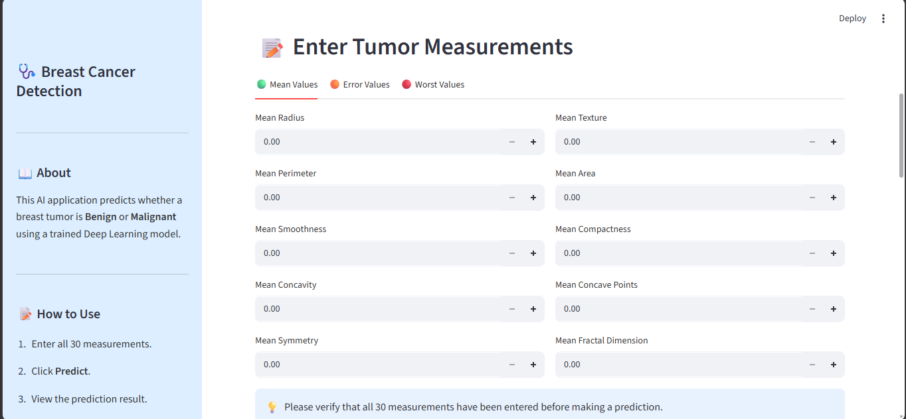
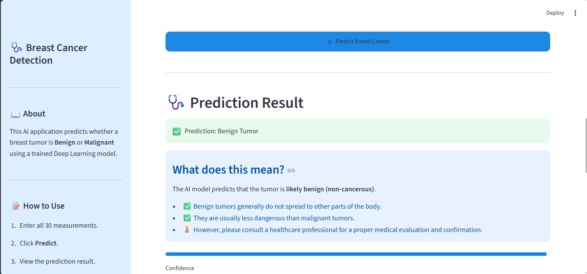

# 🩺 Breast Cancer Detection using Deep Learning


An AI-powered web application that predicts whether a breast tumor is **Benign** or **Malignant** using a trained Deep Learning model. The application is built with **TensorFlow/Keras** and deployed using **Streamlit** to provide an easy-to-use interface for users.

> **⚠️ Disclaimer:** This project is for educational purposes only and should not be used as a substitute for professional medical diagnosis.

---

## 📌 Project Overview

Breast cancer is one of the most common cancers worldwide. Early detection can significantly improve treatment outcomes.

This project uses a **Deep Learning Neural Network** trained on the **Breast Cancer Wisconsin Diagnostic Dataset** to predict whether a tumor is benign or malignant based on **30 tumor measurement features**.

---

## 🚀 Features

- 🧠 Deep Learning model using TensorFlow/Keras
- 🌐 Interactive Streamlit web application
- 📊 Confidence score for each prediction
- 📋 User-friendly interface with organized input tabs
- 🩺 Medical explanation of prediction results
- ⚠️ Medical disclaimer for responsible AI usage
- 🎨 Clean and responsive UI

---

## 🛠️ Technologies Used

- Python
- TensorFlow / Keras
- Scikit-learn
- NumPy
- Pandas
- Pickle
- Streamlit

---

## 📂 Project Structure

```text
BREAST_CANCER_DETECTION/
│── app.py
│── breast_cancer_model.keras
│── scaler.pkl
│── style.css
│── requirements.txt
│── README.md
│── assets/
```

---

## 📊 Dataset

**Dataset:** Breast Cancer Wisconsin Diagnostic Dataset

Features:
- 30 tumor measurement features
- Target Classes:
  - Benign (Non-Cancerous)
  - Malignant (Cancerous)

---

## ⚙️ Installation

### 1️⃣ Clone the Repository

```bash
git clone https://github.com/Rudrajcoder03/Breast_Cancer_Predictor.git
```

### 2️⃣ Navigate to the Project Folder

```bash
cd Breast_Cancer_Detection
```

### 3️⃣ Install Required Libraries

```bash
pip install -r requirements.txt
```

### 4️⃣ Run the Application

```bash
streamlit run app.py
```

---

## 💻 Application Workflow

1. Enter the 30 tumor measurements.
2. Click **Predict Breast Cancer**.
3. The model scales the input using the saved StandardScaler.
4. The trained Deep Learning model predicts the result.
5. The application displays:
   - Prediction (Benign/Malignant)
   - Confidence Score
   - Medical Information
   - Risk Explanation

---

## 📷 Screenshots

### 🏠 Home Page



### 📝 Input Form



### 📊 Prediction Result



## 📈 Future Improvements

- Upload patient data using CSV
- Prediction history
- Downloadable PDF reports
- Graphical data visualization
- Cloud deployment
- Multi-language support

---

## 👨‍💻 Developer

**Rudraj Kumar Nath**

B.Tech CSE (AI)

AI/ML Intern @ InternPe

---

## ⭐ Acknowledgements

- InternPe
- TensorFlow
- Streamlit
- Scikit-learn
- Breast Cancer Wisconsin Diagnostic Dataset

---

## 📜 License

This project is developed for educational and internship purposes.
